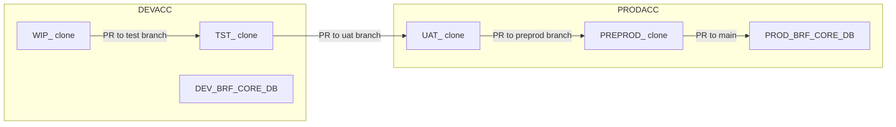

# Plan: Multi-Account DCM Setup (DEVACC + PRODACC)

## Context

**Current state:**

- Single account (`SFPSCOGS-FCRICKDEMO`) with one DCM target (`DEV`)
- Clone types: WIP, TEST, UAT, PREPROD — all in one account
- Branch convention: `feature/<issue>-<topic>-<TARGET>`
- No `.github/workflows/` directory exists yet
- `target_guard.py` enforces branch/target/database consistency

**Key findings from exploration:**

- dcm/manifest.yml — single target, Jinja templating with `{{db}}` and `{{source_stage_db}}`
- .cortex/hooks/target\_guard.py — validates target-env against branch suffix and database references
- .cortex/skills/target-check/SKILL.md — documents clone procedures, session context, and new-issue checklist
- .cortex/workspace.env.example — template for developer local config

**Decisions from user:**

- Accounts: `DEVACC` (dev) and `PRODACC` (prod)
- Roles: prefixed `DEV_` or `PROD_` (e.g., `DEV_BRF_ETL`, `PROD_BRF_ETL`)
- Warehouses: **not prefixed** — same name in both accounts (e.g., `BRF_WH`) for dynamic table DDL portability
- `ADMIN_DB` replicated in both accounts (same `DEPLOY_CLONE` procedure available everywhere)
- CI/CD uses **key-pair** authentication
- UAT/PREPROD clones sourced from the PROD domain database (`PROD_BRF_CORE_DB`)

## Promotion Flow



| Stage       | Account | Clone Prefix | Source DB           | Role                | Branch Pattern                 |
| ----------- | ------- | ------------ | ------------------- | ------------------- | ------------------------------ |
| Development | DEVACC  | `WIP_`       | DEV\_BRF\_CORE\_DB  | DEV\_BRF\_ETL       | `feature/<id>-<topic>-WIP`     |
| Testing     | DEVACC  | `TST_`       | DEV\_BRF\_CORE\_DB  | DEV\_BRF\_ETL       | `test/<id>-<topic>-TST`        |
| UAT         | PRODACC | `UAT_`       | PROD\_BRF\_CORE\_DB | PROD\_BRF\_ETL      | `uat/<id>-<topic>-UAT`         |
| Pre-prod    | PRODACC | `PREPROD_`   | PROD\_BRF\_CORE\_DB | PROD\_BRF\_ETL      | `preprod/<id>-<topic>-PREPROD` |
| Production  | PRODACC | —            | PROD\_BRF\_CORE\_DB | PROD\_BRF\_SYSADMIN | `main`                         |

## Implementation Steps

### 1. Update `dcm/manifest.yml`

Add PROD target and templating config. Warehouse is unprefixed in both:

```yaml
manifest_version: 2
type: DCM_PROJECT
default_target: DEV

targets:
  DEV:
    account_identifier: DEVACC
    project_name: DEV_BRF_CORE_DB.DCM.BRF_CORE_PROJECT
    project_owner: DEV_BRF_SYSADMIN
    templating_config: DEV
  PROD:
    account_identifier: PRODACC
    project_name: PROD_BRF_CORE_DB.DCM.BRF_CORE_PROJECT
    project_owner: PROD_BRF_SYSADMIN
    templating_config: PROD

templating:
  configurations:
    DEV:
      db: DEV_BRF_CORE_DB
      source_stage_db: DEV_BRF_CORE_DB
      wh: BRF_WH
    PROD:
      db: PROD_BRF_CORE_DB
      source_stage_db: PROD_BRF_CORE_DB
      wh: BRF_WH
```

Note: `wh` template variable added so dynamic table DDL can use `{{wh}}` — same value in both configs since warehouses are unprefixed.

### 2. Update `.cortex/workspace.env.example`

```
ISSUE_ID=
DOMAIN=BRF
DB_NAME=CORE

# Connections (one per account in ~/.snowflake/connections.toml)
CONNECTION_DEV=FCRICKDEMO_DEV
CONNECTION_PROD=FCRICKDEMO_PROD

# Derived clone names:
#   WIP:     WIP_<ISSUE_ID>_BRF_CORE_DB      (DEVACC)
#   TST:     TST_<ISSUE_ID>_BRF_CORE_DB      (DEVACC)
#   UAT:     UAT_<ISSUE_ID>_BRF_CORE_DB      (PRODACC)
#   PREPROD: PREPROD_<ISSUE_ID>_BRF_CORE_DB  (PRODACC)
```

### 3. Update `target_guard.py`

Key changes:

- Valid targets: `('WIP', 'TST', 'UAT', 'PREPROD')`
- Map targets to accounts: `WIP`/`TST` → `CONNECTION_DEV`, `UAT`/`PREPROD` → `CONNECTION_PROD`
- Read both connection fields from `workspace.env`
- Validate the connection in the tool input matches the expected account for the current target
- Branch suffix validation remains the same logic

```python
TARGET_ACCOUNT_MAP = {
    'WIP': 'CONNECTION_DEV',
    'TST': 'CONNECTION_DEV',
    'UAT': 'CONNECTION_PROD',
    'PREPROD': 'CONNECTION_PROD',
}
```

### 4. Update `SKILL.md` — Full Promotion Workflow

Document:

- Two accounts with their respective roles (`DEV_BRF_ETL` vs `PROD_BRF_ETL`)
- Same warehouse name (`BRF_WH`) in both
- Clone procedures for each stage (account parameter changes):
  ```sql
  -- DEV account clones
  CALL ADMIN_DB.DEPLOY.DEPLOY_CLONE('<id>', 'DEV', 'BRF', 'CORE', 'WIP');
  CALL ADMIN_DB.DEPLOY.DEPLOY_CLONE('<id>', 'DEV', 'BRF', 'CORE', 'TST');

  -- PROD account clones
  CALL ADMIN_DB.DEPLOY.DEPLOY_CLONE('<id>', 'PROD', 'BRF', 'CORE', 'UAT');
  CALL ADMIN_DB.DEPLOY.DEPLOY_CLONE('<id>', 'PROD', 'BRF', 'CORE', 'PREPROD');
  ```
- Session context per stage:
  ```sql
  -- DEV stages (WIP/TST)
  USE ROLE DEV_BRF_ETL;
  USE WAREHOUSE BRF_WH;
  USE DATABASE <WIP|TST>_<ISSUE_ID>_BRF_CORE_DB;

  -- PROD stages (UAT/PREPROD)
  USE ROLE PROD_BRF_ETL;
  USE WAREHOUSE BRF_WH;
  USE DATABASE <UAT|PREPROD>_<ISSUE_ID>_BRF_CORE_DB;
  ```
- Promotion checklist: how to move from one stage to the next (PR flow)
- DCM deploy commands per target:
  ```
  snow dcm deploy --target DEV --connection FCRICKDEMO_DEV
  snow dcm deploy --target PROD --connection FCRICKDEMO_PROD
  ```

### 5. Create GitHub Actions Workflows

Four workflow files in `.github/workflows/`:

**a) `deploy-test.yml`** — Triggered when PR merges to `test/*` branches

- Authenticates to DEVACC via key-pair (GitHub secrets: `DEV_ACCOUNT`, `DEV_USER`, `DEV_PRIVATE_KEY`)
- Creates TST clone if it doesn't exist
- Runs `snow dcm deploy --target DEV` against the TST clone
- Runs validation tests

**b) `deploy-uat.yml`** — Triggered when PR merges to `uat/*` branches

- Authenticates to PRODACC via key-pair (GitHub secrets: `PROD_ACCOUNT`, `PROD_USER`, `PROD_PRIVATE_KEY`)
- Creates UAT clone if it doesn't exist
- Runs `snow dcm deploy --target PROD` against the UAT clone

**c) `deploy-preprod.yml`** — Triggered when PR merges to `preprod/*` branches

- Same auth as UAT (PRODACC)
- Creates PREPROD clone
- Runs `snow dcm deploy --target PROD` against the PREPROD clone
- Full regression testing

**d) `deploy-prod.yml`** — Triggered when PR merges to `main`

- Authenticates to PRODACC
- Runs `snow dcm deploy --target PROD` against PROD\_BRF\_CORE\_DB directly
- Drops PREPROD and UAT clones for this issue (cleanup)

**GitHub Secrets required:**

| Secret             | Purpose                       |
| ------------------ | ----------------------------- |
| `DEV_ACCOUNT`      | DEVACC account identifier     |
| `DEV_USER`         | Service user in DEVACC        |
| `DEV_PRIVATE_KEY`  | RSA key for DEV service user  |
| `PROD_ACCOUNT`     | PRODACC account identifier    |
| `PROD_USER`        | Service user in PRODACC       |
| `PROD_PRIVATE_KEY` | RSA key for PROD service user |

### 6. Update `AGENTS.md`

Reflect the new multi-account workflow:

- Add the promotion flow table
- Update "What goes where" section
- Reference new workflow files

## Verification

1. **Manifest validation**: `snow dcm plan --target DEV` and `snow dcm plan --target PROD` should both parse without errors
2. **Hook validation**: Switch `target-env` to each value and confirm the guard correctly blocks wrong-account operations
3. **Branch naming**: Create test branches matching each pattern and verify the guard accepts them
4. **Workflow dry-run**: Push a test branch and verify the workflow triggers (set to `workflow_dispatch` initially for testing)
5. **Clone procedure**: Test `DEPLOY_CLONE` calls in both accounts via the respective connections

## Critical Files

- dcm/manifest.yml — Add PROD target and templating config
- .cortex/hooks/target\_guard.py — Extend for dual-account validation
- .cortex/skills/target-check/SKILL.md — Full promotion workflow docs
- .cortex/workspace.env.example — Dual connection template

## Snowflake Prerequisites (in PRODACC)

These must exist before CI/CD can deploy:

- `PROD_BRF_CORE_DB` with schema `DCM`
- `PROD_BRF_SYSADMIN` role owning the DCM project
- `PROD_BRF_ETL` role with deploy permissions
- `BRF_WH` warehouse
- `ADMIN_DB.DEPLOY.DEPLOY_CLONE` procedure (replicated from DEVACC)
- Service user with key-pair auth for CI/CD (granted `PROD_BRF_ETL`)
- Equivalent service user in DEVACC for test deployments
